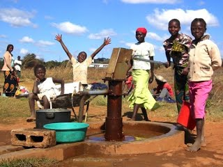
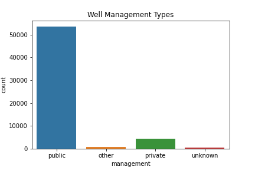
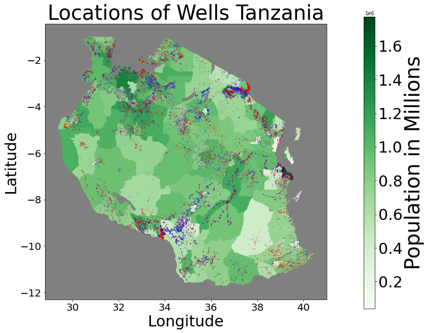
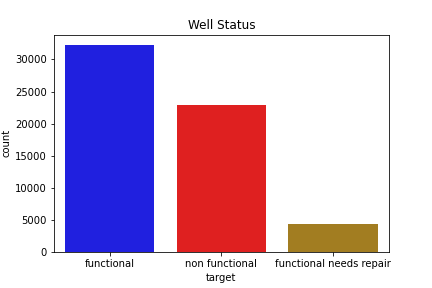
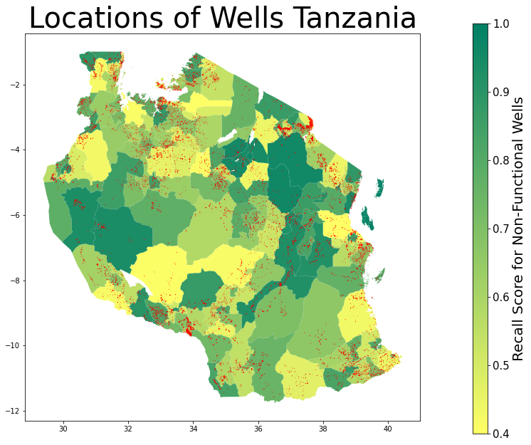
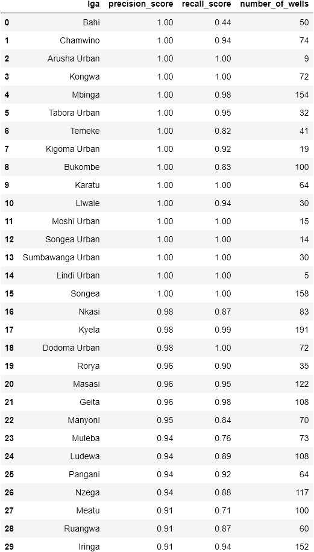

# Predicting Broken Wells in Tanzania

  

photo courtesy of <a href = https://sites.google.com/site/tanzaniawateraidproject/two-solutions"> Tanzania Water Aid Project </a>

# Understanding the Problem

Clean water is crucial to the Tanzanian people.  Rain comes only seasonally with long wet and dry seasons, and many community water sources are seasonal as well. 

>4 million people in Tanzania lack access to an improved source of safe water, and 30 million don't have access to improved sanitation. People living under these circumstances, particularly women and girls, spend a significant amount of time traveling long distances to collect water. 1

We used the Pump it Up: Data Mining the Water Table2 dataset from the Driven Data competition.  This dataset has information about wells in Tanzania recorded between 2002 and 2013.  The features of this dataset include information about when, how, and who constructed the wells, where they are located, what methods they use to extract and distribute water, water quality and quantity, well management and how individuals pay for the water they take.

  

A large number of organizations have funded and installed wells in the country. Most are now managed locally by village water associations and trusts, but some are managed by for-profit companies or private individuals.

The wells are not uniformly distributed, as you can see on the map below.  It seems certain regions have attracted more projects than others.

  

The blue dots are functioning wells (as of 2013) and the red dots are broken wells.  You can see how well projects have been focused in certain regions with large tracts mostly neglected.  The shade of green or yellow of each region indicates the total population of that region.  While in some cases the density of wells correlates with the population, in others it does not.

The good news is that most wells in Tanzania were functioning in 2013, and innovations such as solar powered wells have reduced the cost of operation and maintenance of many wells.  However, disrepair is still an issue in many places and well maintenance can save many lives from starvation, thirst, and water-borne disease.

  

# Understanding The Data

The dataset we used contains volumnious and often redundant information about each well.  Many features were overlapping, such as `water_quality` and `water_quality_group` or `scheme_management` and `management`.  Others had too many categorical values to encode, or were to specific to be useful in making predictions, such as `scheme_name` or `installer`. Here is a comprehensive description of the features and their meanings:

## Features:
1. `amount_tsh`: total static head.  How high the water gets pumped from where it starts.
2. `date_recorded`: when this row was updated/created
3. `funder`: who funded the well
4. `gps_height`: altitude of well
5. `installer`: who installed the well
6. `latitude`/`longitude`: location of well
7. `wpt_name`: name of the waterpoint (well)
8. `basin`: geographic water basin
9. `subvillage`: village or street, see Regional subdivisions in Tanzania below
10. `region`: see Regional subdivisions in Tanzania below
11. `region code`: 
12. `district code`:
13. `lga`: district, see Regional subdivisions in Tanzania below
14. `ward`: see Regional subdivisions in Tanzania below
15. `population`: population around well (subvillage?)
16. `public meeting`: ? (true/false/NaN)
17. `recorded_by`: group entering data for this row
18. `scheme_management`: type of management.  (see Water Management Types below)
19. `scheme_name`: name of well management group
20. `permit`: is permitted by local water basin authority
21. `construction_year`: year constructed
22. `extraction_type`: specific extraction method
23. `extraction_type_group`: less specific than extraction_type
24. `extraction_type_class`: broadest class of extraction type
25. `management`: how well is managed: see Water Management Types below
26. `management_group`: broader type of management: see Water Management Types below
27. `payment`/`payment_type`: how the water is paid for.
28. `water_quality`: description of water from well
29. `quality_group`: less specific quality type.
30. `quantity`/`quantity_group`: how much water or when there is water
31. `source`/`source_type`/`source_class`: where the water from the well comes from 
32. `waterpoint_type`/`waterpoint_type_group`: type of extraction point, what users interact with to get water.

### Redundant and Overlapping Features:
1. basin, subvillage, region, region code, district code, lga, ward: 
2. water_quality, and quality_group
3. quantity, quantity group
4. source, source_type, source_class
5. waterpoint_type, waterpoint_type_group
6. payment, payment_type
7. management, management_group, scheme_management
8. extraction_type, extraction_type_class, extraction_type_group

Here is some supplemental information about the categories of some of these features, taken from outside sources:

### Water Management Types: 3

*Village Water Committee* – Initiated as a formalised water point management structure in the 1991
Water Policy, these bodies continue to exist in all villages visited in Dodoma (although not in
Singida) as a regulatory body with elected membership. They are effectively the default
management framework across the three regions. The VWC is a cosignatory with the DWE to the
village water fund.

*Private Operator* – An individual or group that is contracted by the VWC or other official body to
undertake operation and some maintenance of the extraction system or single DP for an
arranged fee. Tenderer is sometimes used as an alternative name; Wakala is the official term in
Dodoma Rural and some other areas; Mpwapwa more commonly uses Mbia, or ‘caretakers’.

*Water User Association* – A legal entity autonomous from village government that oversees the
management of an entire extraction system. The WUA has its own fund which functions as the
village water fund. Officially, it will have authority over the Water User Groups (WUGs) using the
water source.

*Water User Group* – These are the sub-village level management groups that are responsible for
operation and maintenance of specific DPs within a WUA. In practice, sub-villages do not always
create WUGs so management will revert to the WUA. Has its own bank account to fund small
repairs and regular maintenance.

*School* – Refers to extensions of systems to schools. The water points are public but managed fully
by the school and are often obligated to pay a contribution to the village water fund.

*Private* – A privately funded extension to a water system. The owner may sell on the water and often
must allow public access to any DP on the private system.

*Company* – A legal entity sometimes under contract.

*Board/Trust* – Also a legal entity, autonomous from village government that takes the place of VWCs.

*Government* – Only very few DPs of this type exist and they are almost exclusively in Iramba district,
Singida. While there is no first hand evidence to explain this system it most probably describes a
take-over by village government in the absence of a VWC or other management type. 

**Additional**

*Parastatal* -- Corporate held, in contract with the government.

*SWC* -- Soil and water conservation(?)

### Regional subdivisions in Tanzania: 4

The administrative divisions of Tanzania are controlled by Part I, Article 2.2 of the Constitution of Tanzania.[1] 

* Tanzania is divided into thirty-one regions (mkoa in Swahili). 

* Each region is subdivided into districts (wilaya in Swahili). 

* The districts are sub-divided into divisions (tarafa in Swahili) and

* further into local wards (kata in Swahili). 

* Wards are further subdivided for management purposes: for urban wards into streets (mtaa in Swahili) and for rural wards into villages (kijiji in Swahili). 

* The villages may be further subdivided into hamlets (vitongoji in Swahili).

For a comprehensive explanation of each feature in the dataset, see our report notebook in the report folder.

# Preparing the Data

* First: we dropped very specific features and kept only one of each of the redundant features identified above.
* Second: we scaled the numeric data so each features' values were comparable to each other.  This helps prediction models to compare features evenly without losing information.  
* Third: `date_recorded` was originally full of strings of dates, but we transformed them into numbers with the whole number as the year and the decimal representing the months (1/month).  
* Fourth: we imputed missing values in `permits` column, filling missing values with the most common value.  Then we replaced the '0' entries for `construction_date` with the median date.
* Fifth: with `date_recorded` as a number and all values of `construction_year` we were able to add a feature describing the age of the pump.  We predicted this would be very important in predicting its need for maintenance.
* Finally: We one-hot-encoded categorical features, creating a binary column for each category within them.  Algorithmic models can only understand numbers.  

# The Model

Our first step in creating a predictive model was to choose a target metric.  Communities without a reliable water source face death, disease, and hardship, so we decided to create a model that prioritizes identifying wells that are or will soon be non functional.  Those are the communities that are most in need of assistance and are in the worst danger.  The metric we used for this model was a recall score on non functioning wells.  This score specifically reduces false negative results, which would lead to broken wells that go unserviced.  However, it also allows for more false positives, possibly resulting in wasted trips for teams deployed to repair them.  There may, however, be other benefits to an official visit to a remote or vulnerable population.

# ADD MORE HERE

# Model Evaluation

Our model is very accurate in identifying wells potentially needing repair.
# Say more here

# Business Deployment

We optimized our model to predict as many non functioning wells as possible, however we understand that deploying teams to remote regions to repair wells is costly both in time and resources.  

The map below shows the regions where our model is overall most accurate in classifying wells as non functioning, well functioning or functioning but in need of repair.

Since resources for emergency well repair may be limited, the following list shows where our model is most certain about about the wells it flags as non functional.  In these regions, teams deployed to fix wells will make the fewest wasted trips.

# Summary

We addressed the problem of broken wells and communities without access to clean water in Tanzania by creating a predictive model to identify wells that will cease to provide this important resource.  We studied the problem and the data available, iterated through several model prototypes, and developed a model successfully predicts almost 80% of failing wells.  Since our model was not uniformly accurate in all regions of the country, we identified those regions where our model could most efficiently be used to provide emergency maintenance to wells serving local populations.

We hope our predictive model will assist governmental and aid organizations in targeting failed wells for maintenance. Clean and functional wells save lives.

## References:
1 "Tanzania's Water and Sanitation Crisis" [water.org](https://water.org/our-impact/where-we-work/tanzania/)

2 "Pump it Up: Data Mining the Water Table" [DrivenData.org](https://www.drivendata.org/competitions/7/pump-it-up-data-mining-the-water-table/page/23/)

3 (.pdf) [PRIVATE OPERATION IN THE RURAL WATER SUPPLY IN CENTRAL TANZANIA: QUICK FIXES AND SLOW TRANSITIONS](https://washmatters.wateraid.org/publications/private-operation-in-the-rural-water-supply-in-central-tanzania-quick-fixes-and-slow) Moon, Sam.  August 2006

4 "Subdivisions of Tanzania" [wikipedia](https://en.wikipedia.org/wiki/Subdivisions_of_Tanzania)
